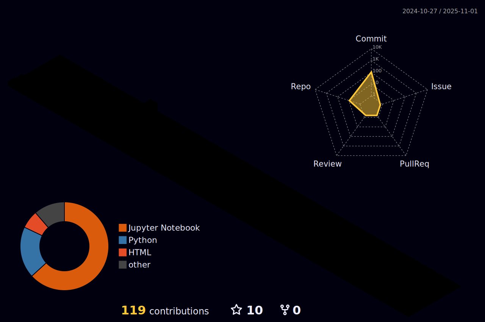

<h1 align="center">Hi 👋, I'm Mohd Muttalib</h1>
<h3 align="center">Data Scientist </h3>
 
 
<p align="center">
  <!-- Typing SVG by MMuttalib1326 - https://github.com/MMuttalib1326/readme-typing-svg -->
  <a href="https://github.com/MMuttalib1326/readme-typing-svg">
    </a>
</p>


<p align="left">  </p>

<p align="left"> <a href="https://twitter.com/mmuttalib1326" target="blank"></a> </p>

- 🔭 I’m currently working on [Kaggle](https://www.kaggle.com/mohdmuttalib)

- 👨‍💻 All of my projects are available at [https://www.kaggle.com/mohdmuttalib](https://www.kaggle.com/mohdmuttalib)

- 📫 How to reach me **muttalib1326@gmail.com**

- 💬 Ask me about *| Machine Learning | Artificial Intelligence | Deep Learning | NLP | Computer Vision | Tableau | PowerBi | Excel | Google Analytics.*


<h3 align="left">Connect with me:</h3>
<hr>
<p align="left">
<a href="https://twitter.com/mmuttalib1326" target="blank"></a>
<a href="https://linkedin.com/in/https://www.linkedin.com/in/mohd-muttalib1326/" target="blank"></a>
<a href="https://kaggle.com/https://www.kaggle.com/mohdmuttalib" target="blank"></a>
<a href="https://instagram.com/azmi_n_alig" target="blank"></a>
<a href="https://www.codechef.com/users/https://www.codechef.com/users/muttalib1326" target="blank"></a>
<a href="https://www.hackerrank.com/muttalib1326" target="blank"></a>
<a href="https://www.hackerearth.com/https://www.hackerrank.com/muttalib1326" target="blank"></a>
<a href="https://auth.geeksforgeeks.org/user/https://auth.geeksforgeeks.org/user/muttalib1326/" target="blank"></a>
</p>

<h3 align="left">Languages and Tools:</h3>
<hr>
<p align="left"> <a href="https://aws.amazon.com" target="_blank" rel="noreferrer">  </a> <a href="https://azure.microsoft.com/en-in/" target="_blank" rel="noreferrer">  </a> <a href="https://www.cprogramming.com/" target="_blank" rel="noreferrer">  </a> <a href="https://www.w3schools.com/css/" target="_blank" rel="noreferrer">  </a> <a href="https://dart.dev" target="_blank" rel="noreferrer">  </a> <a href="https://www.djangoproject.com/" target="_blank" rel="noreferrer">  </a> <a href="https://flask.palletsprojects.com/" target="_blank" rel="noreferrer">  </a> <a href="https://git-scm.com/" target="_blank" rel="noreferrer">  </a> <a href="https://hadoop.apache.org/" target="_blank" rel="noreferrer">  </a> <a href="https://heroku.com" target="_blank" rel="noreferrer">  </a> <a href="https://www.w3.org/html/" target="_blank" rel="noreferrer">  </a> <a href="https://www.java.com" target="_blank" rel="noreferrer">  </a> <a href="https://www.linux.org/" target="_blank" rel="noreferrer">  </a> <a href="https://www.mathworks.com/" target="_blank" rel="noreferrer">  </a> <a href="https://www.mysql.com/" target="_blank" rel="noreferrer">  </a> <a href="https://opencv.org/" target="_blank" rel="noreferrer">  </a> <a href="https://www.oracle.com/" target="_blank" rel="noreferrer">  </a> <a href="https://pandas.pydata.org/" target="_blank" rel="noreferrer">  </a> <a href="https://www.python.org" target="_blank" rel="noreferrer">  </a> <a href="https://pytorch.org/" target="_blank" rel="noreferrer">  </a> <a href="https://scikit-learn.org/" target="_blank" rel="noreferrer">  </a> <a href="https://seaborn.pydata.org/" target="_blank" rel="noreferrer">  </a> <a href="https://www.tensorflow.org" target="_blank" rel="noreferrer">  </a> </p>
<h3 align="lest"> Stats: </h3>
<hr>


 
<div align="center">
  <picture>
    <source media="(prefers-color-scheme: light)" srcset="profile-3d-contrib/profile-night-rainbow.svg" width = "98%">
    
  </picture>
</div> 


```C++
 class MESSAGES
 {
   public:
       string THANK_READER()
       {
          return "Thanks for reading my README. Hope to see you again!"
       }
 }

```
 
<h2 align="center">🤝 Support</h2>
<p align="center">💙 If you like my projects, Give them ⭐ and Share it with friends!</p>
</p>
<p align="center"><em><b>I love connecting with different people</b> so if you want to say <b>hi, I'll be happy to meet you more!</b> 😊</em>

<h1 align='center'>⚡️<i>Stay awesome!</i>⚡️</h1>


<h4 align="center">
  <a href="https://mmuttalib1326.github.io/portfolio/" title="Portfolio">🔎 Show More 🔍</a>
</h4>
